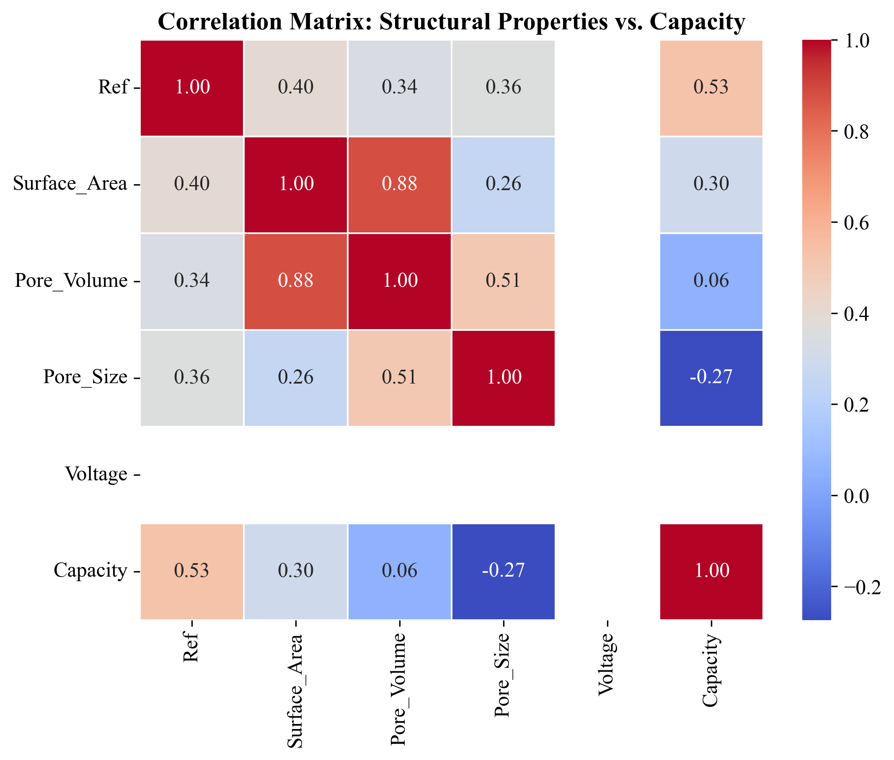
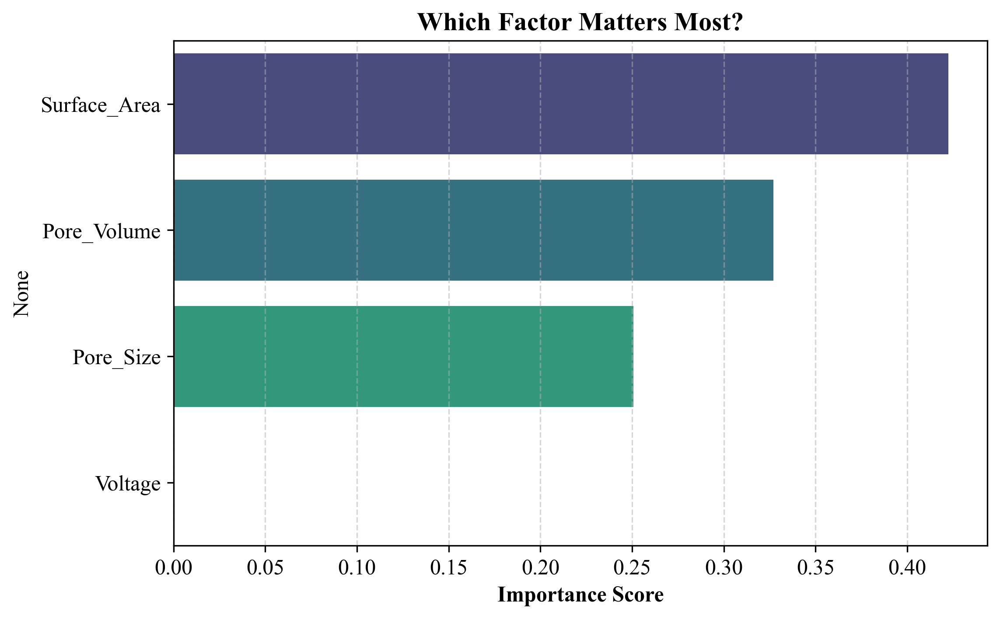

# Machine Learning for CDI: Bio-Carbon Electrodes

## Project Overview
This project applies exploratory Machine Learning (Random Forest) to analyze the relationship between the textural properties of bio-waste-derived carbon electrodes and their salt adsorption capacity in Capacitive Deionization (CDI).

## Dataset
Data was manually curated from **10 recent peer-reviewed publications** focusing on sustainable bio-carbons.
* **Features:** BET Surface Area ($m^2/g$), Total Pore Volume ($cm^3/g$), Average Pore Size ($nm$).
* **Target:** Salt Adsorption Capacity ($mg/g$).

## Visual Results

### 1. Correlation Analysis
The heatmap below illustrates the Pearson correlation coefficients between structural properties and salt adsorption capacity.

### 2. Feature Importance
The Random Forest algorithm was utilized to extract feature importance, revealing the hierarchy of structural parameters affecting CDI performance.

Based on the model's insight, the importance ranks as follows:
1. **Surface Area (Most Critical):** Provides the primary active sites for electrical double layer (EDL) formation and ion electrosorption.
2. **Total Pore Volume:** Dictates the total volumetric capacity for ion storage.
3. **Pore Size:** While essential for ion mobility and preventing size-exclusion effects, it ranked third in this specific literature dataset.

## Model Performance & Limitations
* **Mean Absolute Error (MAE):** 6.78 mg/g
* **Note on R-squared ($R^2$):** The model yielded a negative $R^2$ score (-0.92) on the test set. In machine learning, this is a classic and expected behavior when dealing with extremely small datasets (n=10). Due to the highly limited training data (8 points) and test data (2 points), the model cannot generalize perfectly and is prone to overfitting.
* **Conclusion:** This project serves as a **Proof of Concept (PoC)**. It successfully demonstrates how data-driven workflows can identify key material properties, but a significantly larger dataset is required to train a robust predictive regression model.

## How to Run
1. Install dependencies: `pip install -r requirements.txt`
2. Run `CDI_ML_Analysis.ipynb` to execute the data pipeline.
